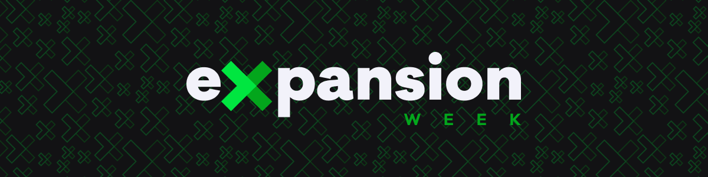
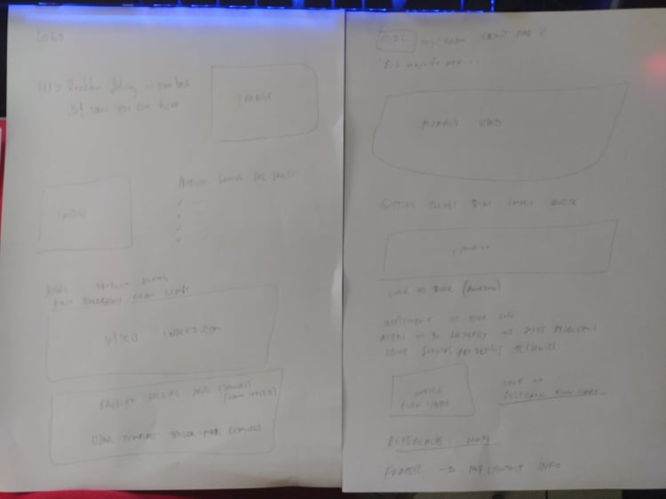
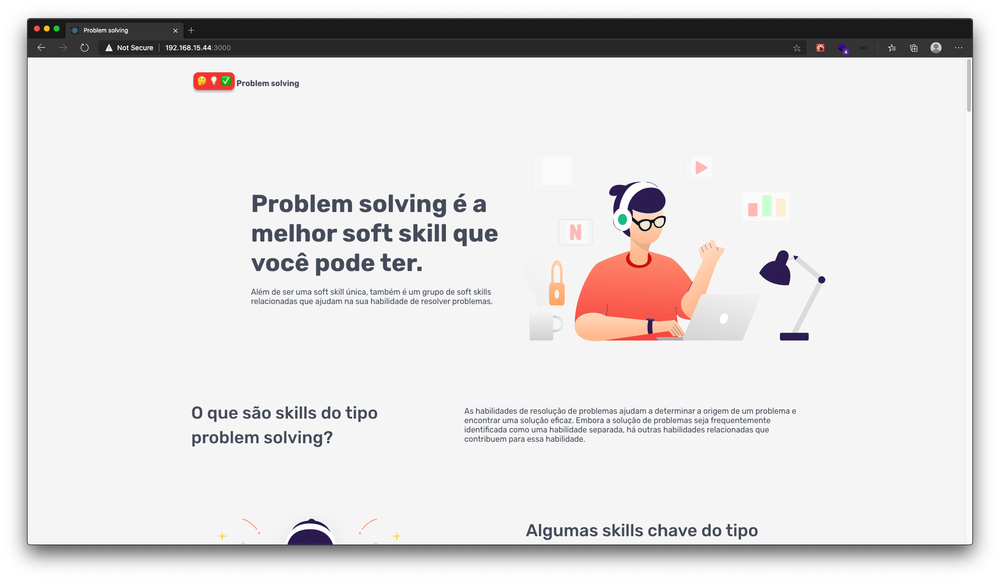

<h3 align="center">
  🚀 Desafio Expansion Week
</h3>

  

### 🚀 Sobre o desafio

Neste desafio foi criada uma landing page do zero falando sobre a soft skill que eu acho mais importante para um dev, no caso a Problem Solving.

Criado com ReactJS.

Link para <a href="https://www.notion.so/930e25512d284241b9b8894a20c53dcc?v=5974ebdedced43a0bcfb4208c667c68f">'gerenciamento' deste projeto.</a>

Wireframe criado no papel

Layout criado no <a href="https://www.figma.com/file/nZXeQMgYqv1AXzDExRRWsr/Problem-Solving?node-id=1%3A2">Figma</a>.

Preview

---

Made with ❤️ by morikawa77
